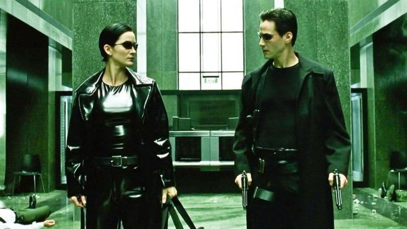

# pixel2vga
pixel2vga is a command-line tool designed to convert RGB Color values to the VGA 256-Color palette.

 
 
 
 

## Usage
```bash
➜  ~ pixel2vga -h
OVERVIEW: A RGB to VGA Color converter 

USAGE: pixel2vga [options] <image file>

OPTIONS:
  -f, --format          File format[jpg <quality 0-100>?/png/bmp/tga/raw]
  -o, --outfile         Output file name
  -h, --help            Display available options
  -v, --version         Display the version of this program
```
```bash
➜  ~ pixel2vga -f jpg -o neo256100.jpg neo.jpg
```
Change JPG quality
```bash
➜  ~ pixel2vga -f jpg 1 -o pris2561.jpg pris.jpg
```


```bash
➜  ~ pixel2vga -f jpg 10 -o pris25610.jpg pris.jpg
```


## License
This project is licensed under the BSD 3-Clause License. See the LICENSE file for details.

